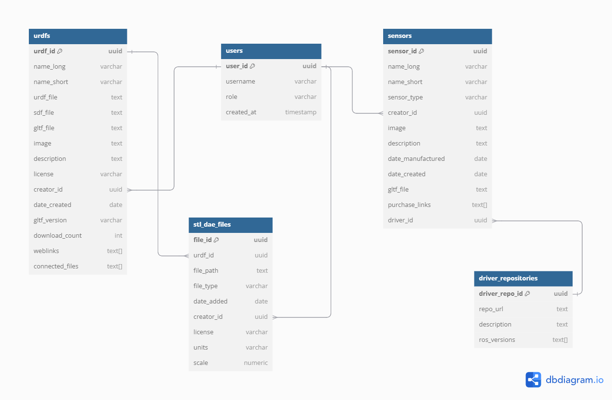

# Database Structure Explanation

This database is designed to manage and organize data related to public URDFs, STL/DAE files, sensors, and sensor driver repositories. Also included is tracking users of the platform and driver repositories for the sensors.

## Tables Overview

### 1. **URDFs Table (`urdfs`)**
   - **Purpose**: This table stores detailed information about public URDF files, including metadata, associated files, and their creators.
   - **Fields**:
     - `urdf_id` (UUID): Primary key, unique identifier for each URDF.
     - `name_long` (varchar): Full name of the URDF.
     - `name_short` (varchar): Short name for easy reference (no spaces or special characters).
     - `urdf_file` (text): Path or URL to the URDF file.
     - `sdf_file` (text): Path or URL to the SDF file.
     - `gltf_file` (text): Path or URL to the GLTF file.
     - `image` (text): URL to an image of the URDF.
     - `description` (text): Description of the URDF.
     - `license` (varchar): Licensing information.
     - `creator_id` (UUID): References `user_id` in the `users` table to link to the creator.
     - `date_created` (date): Date the URDF was created.
     - `gltf_version` (varchar): Version of the GLTF file.
     - `download_count` (integer): Number of times the URDF has been downloaded.
     - `weblinks` (text[]): Array of related URLs.
     - `connected_files` (text[]): Array of URLs or paths to associated STL or DAE files.

### 2. **Users Table (`users`)**
   - **Purpose**: This table stores user information, which is used to link creators to URDFs and STL/DAE files.
   - **Fields**:
     - `user_id` (UUID): Primary key, unique identifier for each user.
     - `username` (varchar): User's name.
     - `role` (varchar): User role, such as 'creator' or 'admin'.
     - `created_at` (timestamp): Timestamp of user creation.

### 3. **STL/DAE Files Table (`stl_dae_files`)**
   - **Purpose**: This table manages STL and DAE files associated with URDFs, including metadata, file details, and licensing.
   - **Fields**:
     - `file_id` (UUID): Primary key, unique identifier for each file.
     - `urdf_id` (UUID): References `urdf_id` in the `urdfs` table to connect files with URDFs.
     - `file_path` (text): Path or URL to the STL or DAE file.
     - `file_type` (varchar): Type of the file, either "STL" or "DAE".
     - `date_added` (date): Date the file was added.
     - `creator_id` (UUID): References `user_id` in the `users` table to link to the file's creator.
     - `license` (varchar): Licensing information for the file.
     - `units` (varchar): Units of measurement (e.g., mm, inch, cm).
     - `scale` (numeric): Scale factor for the file.

### 4. **Sensors Table (`sensors`)**
   - **Purpose**: This table stores information about various sensors, including metadata, purchase links, and optional connection to driver repositories. This data can be updated but for now the gltf file will be essential for importing a sensor. Not going to worry about all the sensor parameters that can be given right now.
   - **Fields**:
     - `sensor_id` (UUID): Primary key, unique identifier for each sensor.
     - `name_long` (varchar): Full name of the sensor.
     - `name_short` (varchar): Short name for easy reference (no spaces or special characters).
     - `sensor_type` (varchar): Type of sensor (camera, lidar, GPS, etc.).
     - `image` (text): URL to an image of the sensor.
     - `description` (text): Description of the sensor.
     - `date_manufactured` (date): Date of manufacture.
     - `date_created` (date): Date the sensor information was added.
     - `gltf_file` (text): Path or URL to the GLTF file of the sensor.
     - `purchase_links` (text[]): Array of URLs for purchasing the sensor.
     - `driver_id` (UUID, optional): References `driver_repo_id` in the `driver_repositories` table to link a sensor to a driver repository.

### 5. **Driver Repositories Table (`driver_repositories`)**
   - **Purpose**: This table tracks GitHub repositories for drivers, including the supported ROS versions and optional linkage to specific sensors. This helps so users can find the right sensors that work for their software versions.
   - **Fields**:
     - `driver_repo_id` (UUID): Primary key, unique identifier for each driver repository.
     - `repo_url` (text): URL to the GitHub repository.
     - `description` (text): Description of what the driver is for.
     - `ros_versions` (text[]): Array of ROS versions compatible with the driver.

## Relationships

- **URDFs and Users**: Each URDF links to a creator in the `users` table via `creator_id`, establishing a many-to-one relationship.
- **STL/DAE Files and Users**: Each STL or DAE file is linked to its creator in the `users` table via `creator_id`.
- **Sensors and Driver Repositories**: Sensors have an optional connection to driver repositories through the `driver_id` field.

This structure ensures a modular and flexible approach to managing URDFs, related STL/DAE files, sensors, and driver repositories, along with user management and interconnections.
